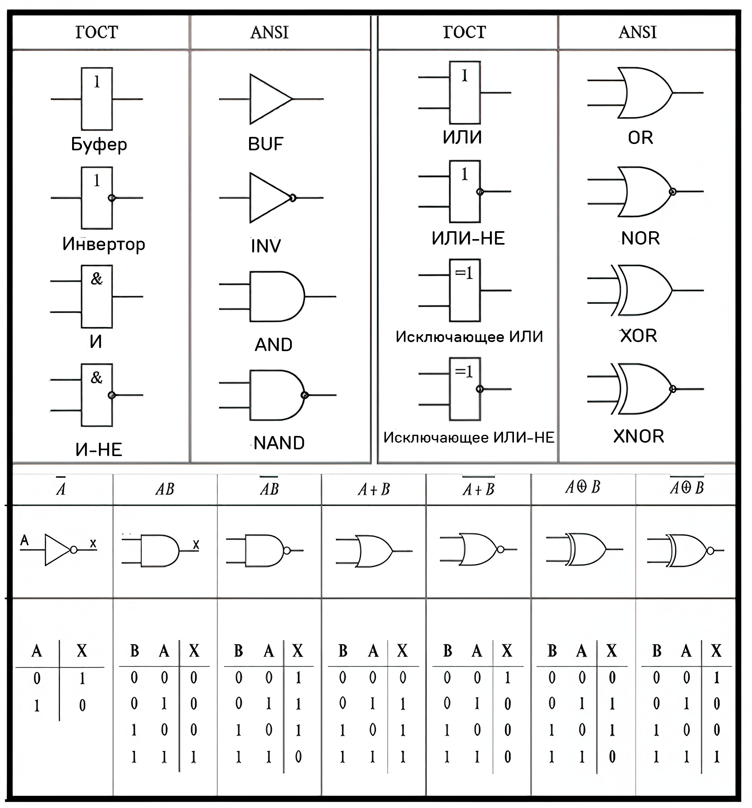

# 🔌 Компьютерная логика

## 📚 Содержание
1. [Основы: Истина (1) и Ложь (0)](#основы-истина-1-и-ложь-0)
2. [Логические операции и их обозначения](#логические-операции-и-их-обозначения)
3. [Порядок выполнения операций](#порядок-выполнения-операций)
4. [Таблицы истинности](#таблицы-истинности)
5. [Логические схемы (вентили)](#логические-схемы-вентили)
6. [Законы для упрощения выражений](#законы-для-упрощения-выражений)
7. [Практика: Упрощение выражений](#практика-упрощение-выражений)

---

## Основы: Истина (1) и Ложь (0)

**Компьютерная логика** (или **булева алгебра**) — это система, которая работает только с двумя значениями: **истина (1)** и **ложь (0)**.

- ⚡ **1**: истина, True, да, включено.
- ⚪ **0**: ложь, False, нет, выключено.

Вся компьютерная логика строится из трёх базовых операций:
1.  **НЕ** (инверсия) — меняет значение на противоположное.
2.  **И** (конъюнкция) — истина, только если **ВСЕ** условия истинны.
3.  **ИЛИ** (дизъюнкция) — истина, если **ХОТЯ БЫ ОДНО** условие истинно.

---

## Логические операции и их обозначения

Каждая операция имеет несколько вариантов записи. Знание их необходимо для решения задач.

| Операция | Математика | Программирование | Схемы (ГОСТ) | Описание |
|---|---|---|---|---|
| **НЕ** (инверсия) | $\overline{A}$, $\neg A$, $A'$ | `!A`, `NOT A` | Кружок на выходе | Противоположное значение |
| **И** (конъюнкция) | $A \land B$, $A \cdot B$, $AB$ | `A && B`, `A AND B` | & | Истина, если **ВСЕ** истинны |
| **ИЛИ** (дизъюнкция) | $A \lor B$, $A + B$ | `A \|\| B`, `A OR B` | ≥1 | Истина, если **ХОТЯ БЫ ОДНО** истинно |
| **Искл. ИЛИ** (XOR) | $A \oplus B$, $A \veebar B$ | `A ^ B`, `A XOR B` | =1 | Истина, если значения **РАЗНЫЕ** |
| **И-НЕ** (NAND) | $A \mid B$, $A \uparrow B$ | `A NAND B` | & с кружком | НЕ(A И B) |
| **ИЛИ-НЕ** (NOR) | $A \downarrow B$ | `A NOR B` | ≥1 с кружком | НЕ(A ИЛИ B) |
| **Эквивалентность** (XNOR) | $A \odot B$, $A \leftrightarrow B$ | `A XNOR B` | =1 с кружком | Истина, если значения **ОДИНАКОВЫЕ** |

### Таблицы истинности для основных операций

#### НЕ (NOT)
Меняет значение на противоположное.
| A | $\overline{A}$ |
|---|---|
| 0 | 1 |
| 1 | 0 |

#### И (AND)
Истина, только если **оба** истинны.
| A | B | $A \land B$ |
|---|---|---|
| 0 | 0 | 0 |
| 0 | 1 | 0 |
| 1 | 0 | 0 |
| 1 | 1 | 1 |

#### ИЛИ (OR)
Истина, если **хотя бы один** истинен.
| A | B | $A \lor B$ |
|---|---|---|
| 0 | 0 | 0 |
| 0 | 1 | 1 |
| 1 | 0 | 1 |
| 1 | 1 | 1 |

#### Исключающее ИЛИ (XOR)
Истина, только если входы **разные**.
| A | B | $A \oplus B$ |
|---|---|---|
| 0 | 0 | 0 |
| 0 | 1 | 1 |
| 1 | 0 | 1 |
| 1 | 1 | 0 |

---

## Порядок выполнения операций

Как в математике, у логических операций есть приоритет.

| Приоритет | Операция | Обозначение | Аналог |
|---|---|---|---|
| **1** (высший) | Скобки | `( )` | Скобки |
| **2** | **НЕ** (инверсия) | $\overline{A}$, $\neg A$ | Унарный минус |
| **3** | **И** (конъюнкция) | $\land$, $\cdot$ | Умножение |
| **4** | **ИЛИ** (дизъюнкция) | $\lor$, $+$ | Сложение |
| **5** | **XOR**, **эквивалентность** | $\oplus$, $\leftrightarrow$ | - |

**Правило:** Сначала **скобки**, затем **НЕ**, затем **И**, затем **ИЛИ**.

**Пример:** `A ∨ B ∧ C` вычисляется как `A ∨ (B ∧ C)`. Если нужен другой порядок, используйте скобки: `(A ∨ B) ∧ C`.

---

## Таблицы истинности

**Таблица истинности** — это таблица, показывающая результат функции для **всех** возможных комбинаций входов.

-   **Количество строк = $2^n$**, где `n` — количество переменных.
    -   2 переменные (A, B) → $2^2 = 4$ строки.
    -   3 переменные (A, B, C) → $2^3 = 8$ строк.

#### Как строить таблицу (на примере $F = (A \lor \overline{B}) \land B$)

1.  **Создаем столбцы** для входов (A, B) и для каждого действия.
2.  **Заполняем входы** по принципу двоичного счета:
    -   Правый столбец (B): `0, 1, 0, 1...`
    -   Следующий столбец (A): `0, 0, 1, 1...`
3.  **Вычисляем по шагам** согласно приоритету операций.

| A | B | $\overline{B}$ | $A \lor \overline{B}$ | **F = $(A \lor \overline{B}) \land B$** |
|---|---|---|---|---|
| 0 | 0 | 1 | 1 | **0** |
| 0 | 1 | 0 | 0 | **0** |
| 1 | 0 | 1 | 1 | **0** |
| 1 | 1 | 0 | 1 | **1** |

Это основной метод для **Задачи 1 (вычисление значения)** и **Задачи 2 (поиск формулы по таблице)**.

---

## Логические схемы (вентили)

**Логический вентиль** — это графическое обозначение логической операции в схемах. Существует два стандарта: американский (ANSI) и российский (ГОСТ). В задачах чаще всего встречается ГОСТ.



#### Как читать схемы (ГОСТ)

-   **Прямоугольник** — это сам вентиль.
-   **Символ внутри** определяет операцию:
    -   `&` — это **И** (конъюнкция).
    -   `≥1` — это **ИЛИ** (дизъюнкция).
    -   `=1` — это **XOR** (исключающее ИЛИ).
-   **Кружок `○` на выходе** означает **НЕ** (инверсию).
    -   `&` с кружком — это **И-НЕ**.
    -   `≥1` с кружком — это **ИЛИ-НЕ**.

#### Задача 3: От формулы к схеме

**Алгоритм:**
1.  Определите **последнюю** операцию в выражении (согласно приоритету). Это будет выходной (самый правый) вентиль.
2.  Входы для этого вентиля — это результаты предыдущих операций.
3.  Рисуйте схему "справа налево", от выхода к входам.

**Пример:** $F = (A \land B) \lor C$
1.  Последняя операция — `∨` (ИЛИ). Выходной вентиль — `≥1`.
2.  На один его вход подается `C`.
3.  На второй вход подается результат `A ∧ B`. Для этого нужен вентиль `&`.
4.  На входы вентиля `&` подаются `A` и `B`.

#### Задача 4: От схемы к формуле

**Алгоритм:**
1.  Двигайтесь "слева направо", от входов к выходу.
2.  Для каждого вентиля записывайте его операцию в виде под-выражения.
3.  Используйте скобки, чтобы сохранить правильный порядок.

---

## Законы для упрощения выражений

Законы булевой алгебры нужны для **Задачи 5 (упрощение)**. Упрощение делает формулу короче и понятнее.

| Название | Формула для И (`∧`) | Формула для ИЛИ (`∨`) |
|---|---|---|
| **Закон нуля и единицы** | $A \land 0 = 0$ | $A \lor 1 = 1$ |
| | $A \land 1 = A$ | $A \lor 0 = A$ |
| **Закон повторения** | $A \land A = A$ | $A \lor A = A$ |
| **Закон дополнения** | $A \land \overline{A} = 0$ | $A \lor \overline{A} = 1$ |
| **Двойное отрицание** | $\overline{\overline{A}} = A$ | |
| **Переместительный** | $A \land B = B \land A$ | $A \lor B = B \lor A$ |
| **Сочетательный** | $(A \land B) \land C = A \land (B \land C)$ | $(A \lor B) \lor C = A \lor (B \lor C)$ |
| **Распределительный** | $A \land (B \lor C) = (A \land B) \lor (A \land C)$ | $A \lor (B \land C) = (A \lor B) \land (A \lor C)$ |
| **Законы де Моргана** | $\overline{A \land B} = \overline{A} \lor \overline{B}$ | $\overline{A \lor B} = \overline{A} \land \overline{B}$ |
| **Закон поглощения** | $A \land (A \lor B) = A$ | $A \lor (A \land B) = A$ |
| **Закон склеивания** | $(A \land B) \lor (A \land \overline{B}) = A$ | $(A \lor B) \land (A \lor \overline{B}) = A$ |

**Ключевые законы для упрощения:**
-   **Законы де Моргана:** "Разбить" отрицание над скобкой, поменяв `И` на `ИЛИ` (и наоборот).
-   **Закон склеивания:** Убирает переменную, которая встречается с отрицанием и без.
-   **Закон поглощения:** Убирает более сложное выражение.

---

## Практика: Упрощение выражений

**Общая стратегия:**
1.  **Раскрыть отрицания** над скобками (законы де Моргана).
2.  **Раскрыть скобки** (распределительный закон).
3.  **Применить законы** склеивания и поглощения.
4.  **Упростить** с помощью остальных законов (повторения, дополнения и т.д.).

#### Пример 1: Склеивание
Упростить: $(A \land \overline{B}) \lor (A \land B)$
```
= A ∧ (B̅ ∨ B)  // Выносим А за скобку
= A ∧ 1        // По закону дополнения (B ∨ B̅ = 1)
= A            // По закону единицы
```
**Паттерн:** $(X \land Y) \lor (X \land \overline{Y}) = X$

#### Пример 2: Поглощение
Упростить: $A \lor (A \land B)$
```
= A // Сразу по закону поглощения
```
**Интуиция:** Если `A` истинно, все выражение истинно. Если `A` ложно, то `A ∧ B` тоже ложно, и все выражение ложно. Результат зависит только от `A`.

#### Пример 3: Законы де Моргана
Упростить: $\overline{\overline{A} \lor B} \lor A$
```
= (¬(¬A) ∧ ¬B) ∨ A  // По закону де Моргана
= (A ∧ ¬B) ∨ A     // Двойное отрицание
= A                  // По закону поглощения