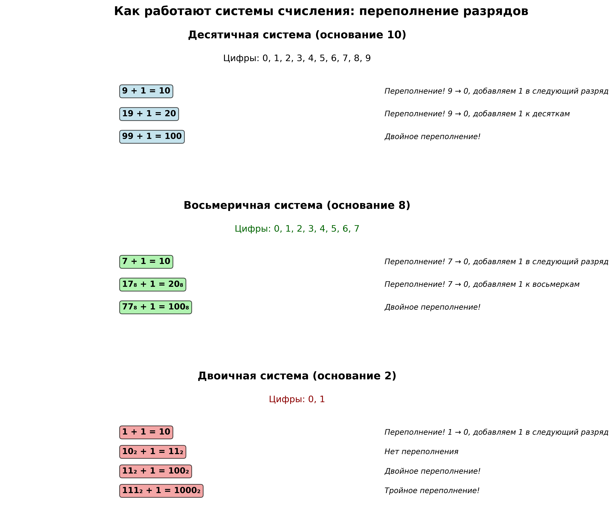
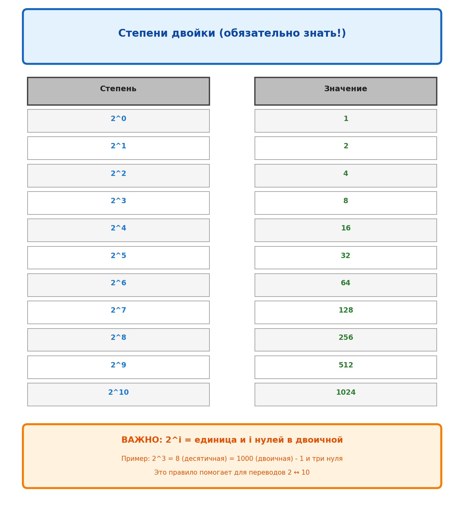
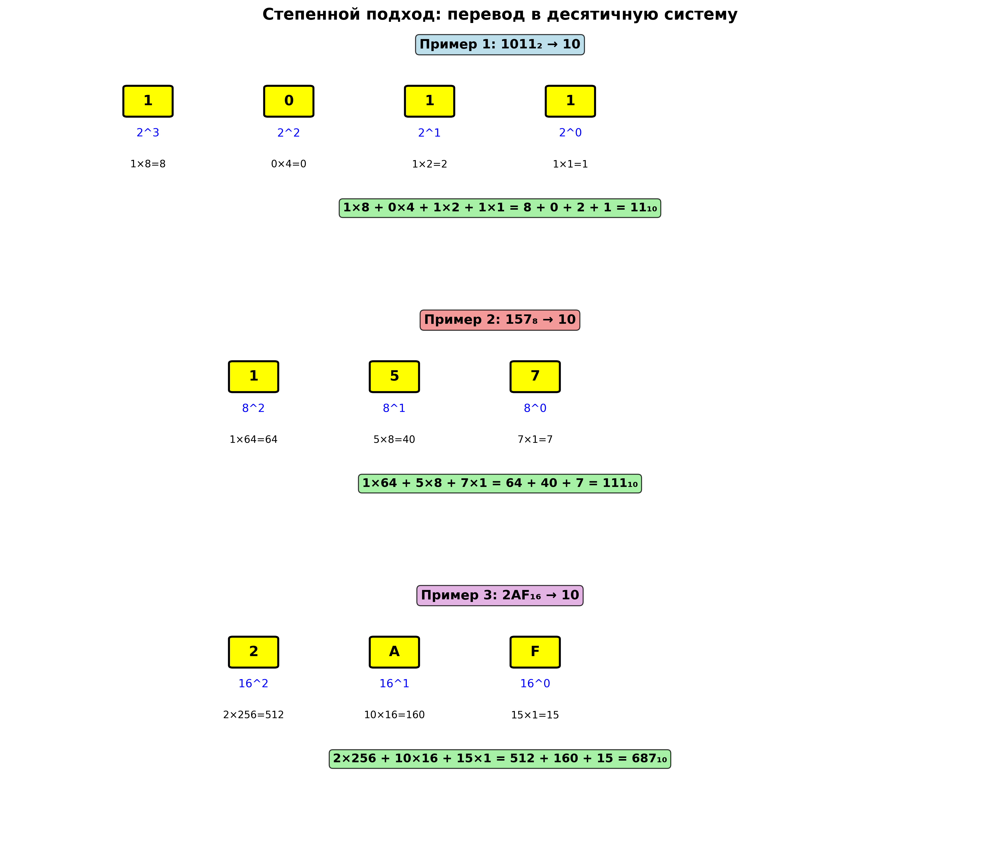
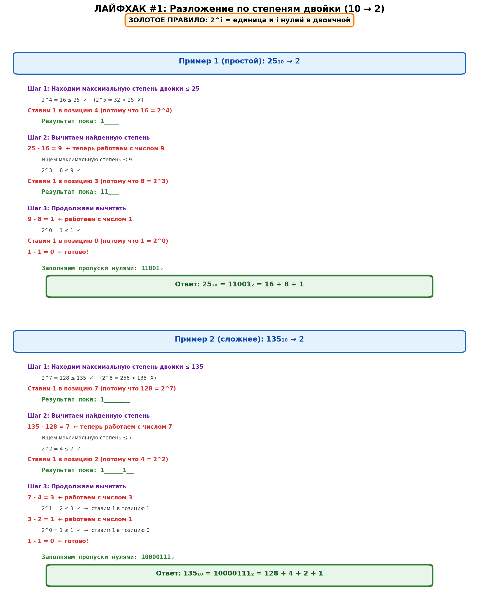
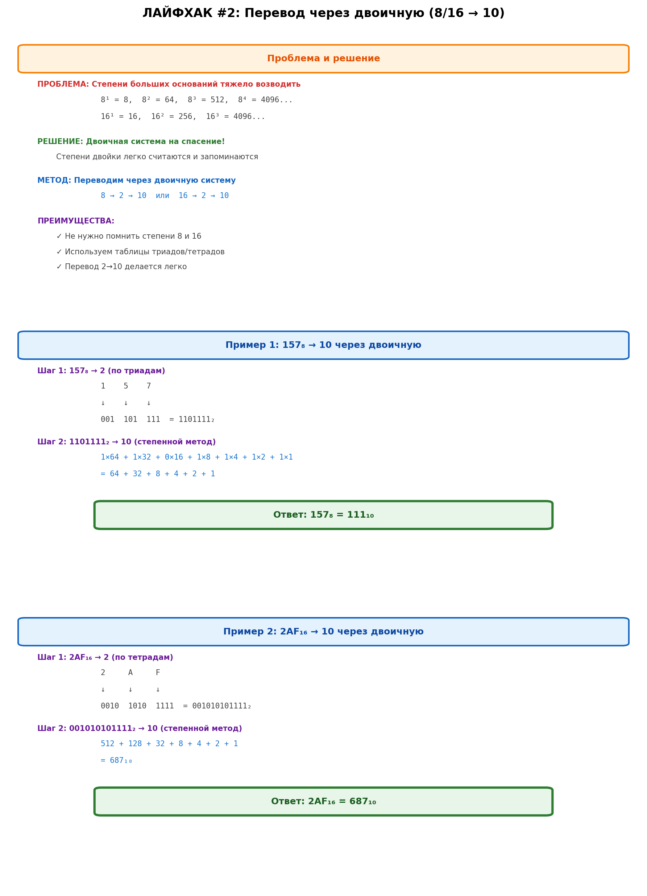
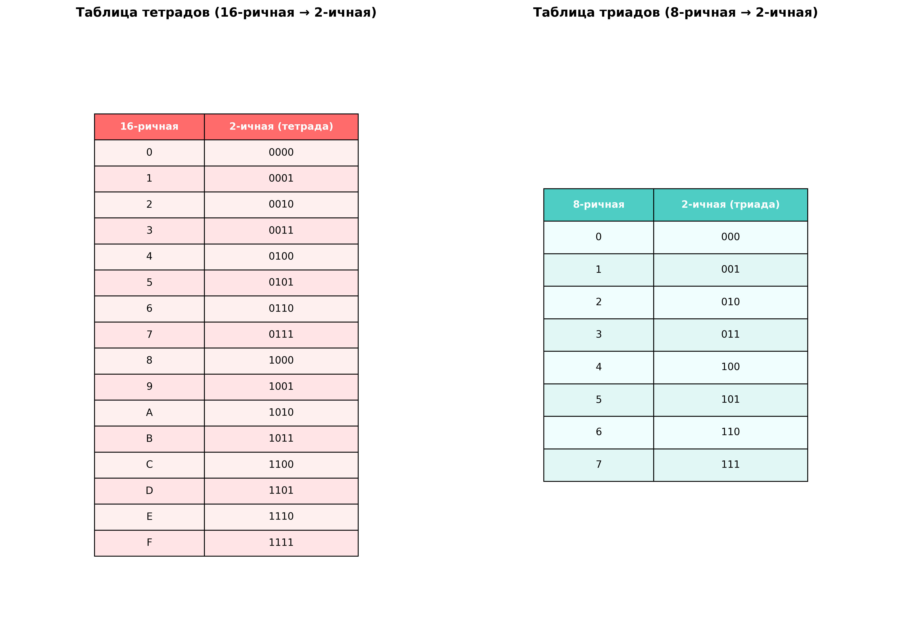
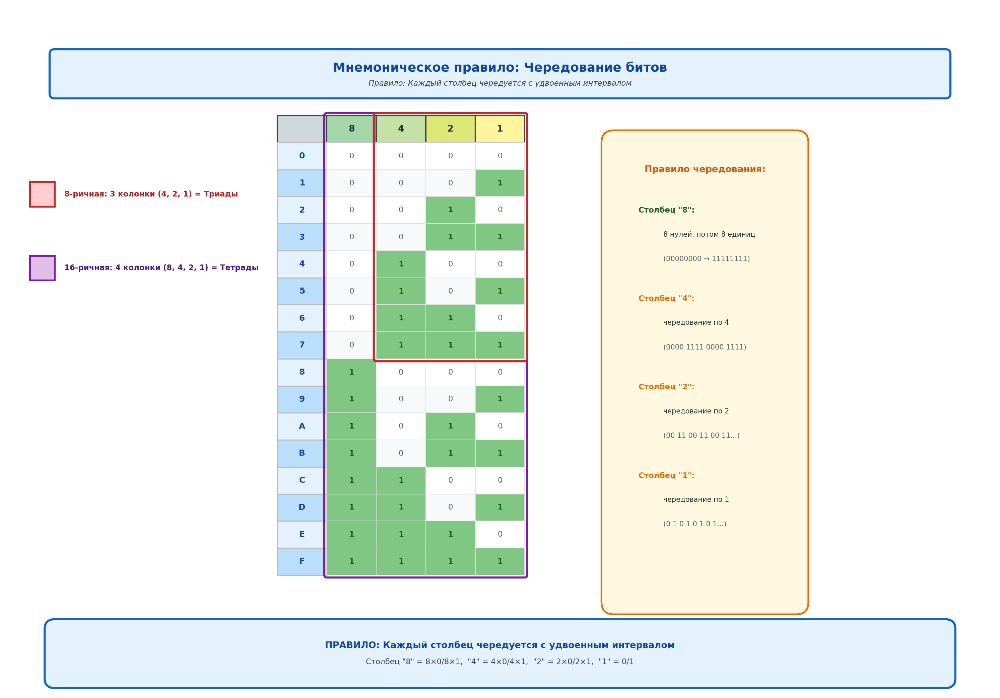
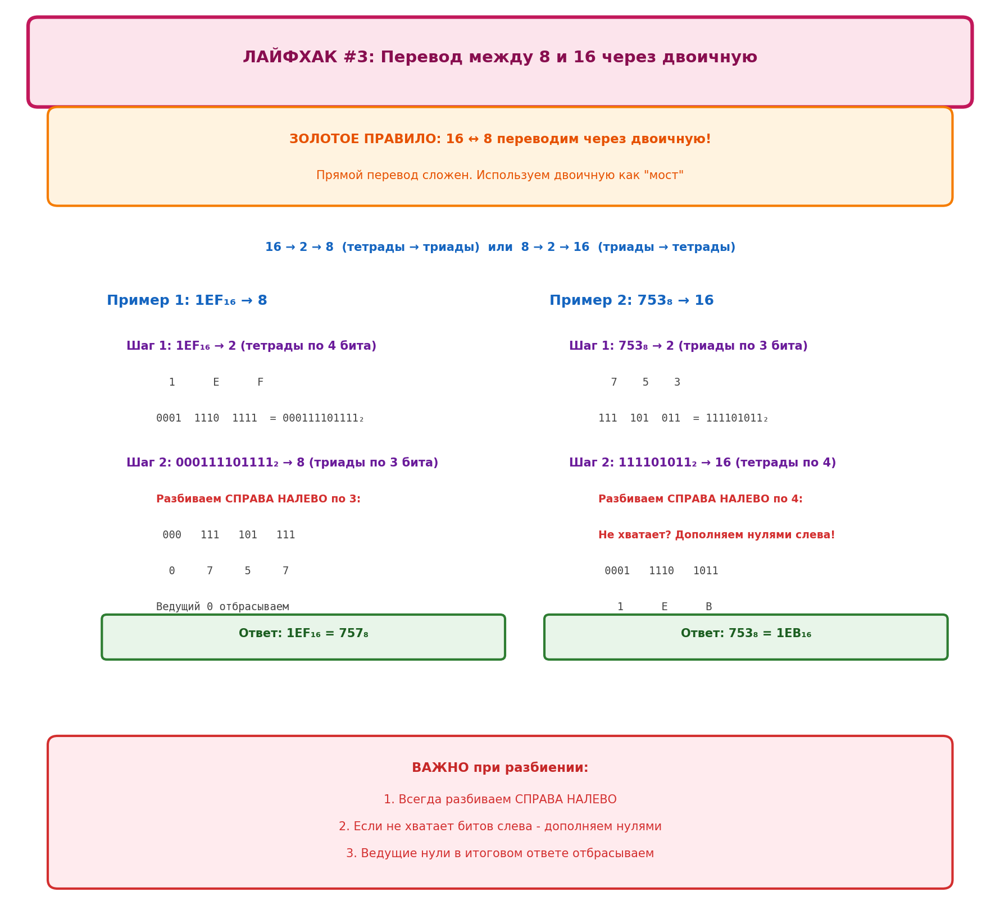
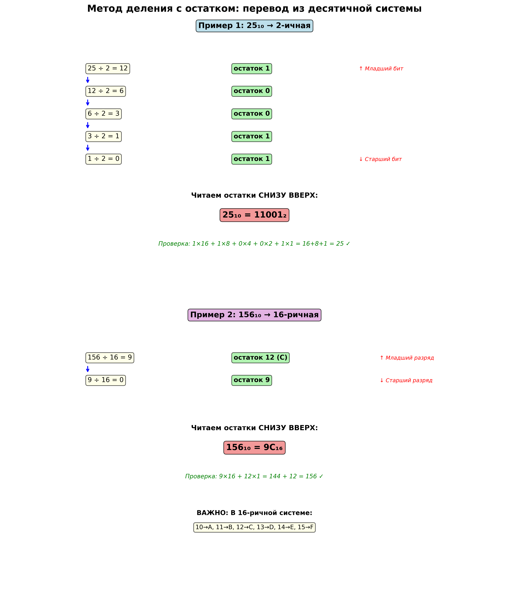

# 🔢 Системы счисления

## 📚 Содержание
1. [Что такое системы счисления?](#что-такое-системы-счисления)
2. [Как работают системы счисления](#как-работают-системы-счисления)
3. [Основные системы счисления](#основные-системы-счисления)
4. [Методы перевода чисел](#методы-перевода-чисел)
   - [Метод 1: Степенной подход (из любой → в десятичную)](#метод-1-степенной-подход)
     - [💡 Лайфхак #1: Разложение по степеням двойки](#-лайфхак-1-разложение-по-степеням-двойки-10--2)
     - [💡 Лайфхак #2: Перевод через двоичную (8/16 → 10)](#-лайфхак-2-перевод-через-двоичную-816--10)
   - [Метод 2: Таблица триадов и тетрадов (8/16 → 2)](#метод-2-таблица-триадов-и-тетрадов)
     - [💡 Лайфхак #3: Перевод между 8 и 16 через двоичную](#-лайфхак-3-перевод-между-8-и-16-через-двоичную)
   - [Метод 3: Деление с остатком (из 10 → в любую)](#метод-3-деление-с-остатком)

---

## Что такое системы счисления?

**Система счисления (СС)** — это способ записи чисел с помощью определённого набора символов (цифр) по определённым правилам.

### Классификация систем счисления

| Тип | Описание | Примеры |
|-----|----------|---------|
| **Непозиционная** | Значение цифры не зависит от её положения в числе | Римская (I, V, X, L, C, D, M) |
| **Позиционная** | Значение цифры зависит от её позиции (разряда) | Десятичная, двоичная, восьмеричная, шестнадцатеричная |

**Недостатки непозиционных систем:**
- ❌ Нельзя записывать дробные и отрицательные числа
- ❌ Сложно выполнять арифметические операции
- ❌ Для больших чисел нужны новые символы

**Преимущества позиционных систем:**
- ✅ Компактная запись любых чисел
- ✅ Простые правила арифметики
- ✅ Фиксированный набор цифр

---

## Как работают системы счисления

**Основание системы счисления** — это количество уникальных цифр, используемых в системе.

### 🔑 Ключевой принцип: переполнение разрядов

Когда мы достигаем максимальной цифры в системе и добавляем 1, происходит **переполнение** — текущий разряд обнуляется, а следующий увеличивается на 1.



### Примеры переполнения:

**Десятичная система (основание 10):**
- Цифры: 0, 1, 2, 3, 4, 5, 6, 7, 8, 9
- `9 + 1 = 10` ← переполнение!
- `99 + 1 = 100` ← двойное переполнение!

**Восьмеричная система (основание 8):**
- Цифры: 0, 1, 2, 3, 4, 5, 6, 7
- `7 + 1 = 10₈` ← переполнение!
- `77₈ + 1 = 100₈` ← двойное переполнение!

**Двоичная система (основание 2):**
- Цифры: 0, 1
- `1 + 1 = 10₂` ← переполнение!
- `11₂ + 1 = 100₂` ← двойное переполнение!
- `111₂ + 1 = 1000₂` ← тройное переполнение!

---

## Основные системы счисления

| Система | Основание | Цифры | Применение |
|---------|-----------|-------|------------|
| **Двоичная** | 2 | 0, 1 | Внутреннее представление данных в компьютере. Каждый разряд = **бит** |
| **Восьмеричная** | 8 | 0-7 | Компактная запись двоичных чисел (1 цифра = 3 бита) |
| **Десятичная** | 10 | 0-9 | Повседневная жизнь человека |
| **Шестнадцатеричная** | 16 | 0-9, A-F | Цветовые коды (#FF5733), адреса памяти, коды ошибок |

### Шестнадцатеричные буквы:
```
A = 10    B = 11    C = 12    D = 13    E = 14    F = 15
```

**Обозначение принадлежности к системе:**
- Индекс внизу справа: `1011₂`, `157₈`, `2AF₁₆`
- Префиксы в программировании: `0b1011`, `0o157`, `0x2AF`

---

## Методы перевода чисел

> **⭐ Важное замечание:** Если вы освоите "лайфхаки" (быстрые методы), вам практически никогда не придётся использовать самый трудоёмкий метод — "Деление с остатком". Старайтесь всегда искать более простой путь!

### Метод 1: Степенной подход
**Направление:** Из любой системы → в десятичную (2→10, 8→10, 16→10)

#### 🎯 Суть метода простыми словами:

Этот метод позволяет переводить числа **из любой системы счисления в десятичную**.

Чтобы перевести число из любой системы в десятичную, нужно:

1. **Пронумеровать цифры справа налево, начиная с 0**
2. **Умножить каждую цифру на основание системы в степени её позиции**
3. **Сложить все результаты**

**Основание системы** — это то число, которое стоит в индексе (₂, ₈, ₁₆)

**Проблема:** Когда основание большое (8 или 16), возводить в степень долго и легко ошибиться!
**Решение:** Используем лайфхаки с двоичной системой (см. ниже)

#### 📝 Простой пример: 354₈ → 10

**Шаг 1:** Нумеруем цифры справа налево с нуля:
```
  3    5    4
  ↑    ↑    ↑
позиция 2, позиция 1, позиция 0
```

**Шаг 2:** Умножаем каждую цифру на 8 (основание) в степени её позиции:
```
3 × 8² + 5 × 8¹ + 4 × 8⁰
```

**Шаг 3:** Вычисляем:
```
3 × 64 + 5 × 8 + 4 × 1 = 192 + 40 + 4 = 236₁₀
```

**Вот и всё!** 354₈ = 236₁₀

#### 💡 Важно знать: степени двойки



| Степень | Значение | Запомни |
|---------|----------|---------|
| 2⁰ | 1 | Любое число в степени 0 = 1 |
| 2¹ | 2 | |
| 2² | 4 | |
| 2³ | 8 | |
| 2⁴ | 16 | |
| 2⁵ | 32 | |
| 2⁶ | 64 | |
| 2⁷ | 128 | |
| 2⁸ | 256 | |
| 2⁹ | 512 | |
| 2¹⁰ | 1024 | ≈ 1 килобайт |

#### ⭐ ЗОЛОТОЕ ПРАВИЛО: Степени двойки легко учить!

**Почему степени двойки запомнить проще всего:**
- Каждая следующая степень = предыдущая × 2
- 2⁰ = 1, потом просто умножаем на 2 в уме
- 2¹ = 2, 2² = 4, 2³ = 8, 2⁴ = 16, 2⁵ = 32...
- **Степени 2 даже учить не надо — они легко считаются!**

**⚡ ВАЖНОЕ НАБЛЮДЕНИЕ про 2^i:**
```
2^i = единица и i нулей в двоичной системе

2³ = 8₁₀ = 1000₂  (1 и три нуля)
2⁵ = 32₁₀ = 100000₂  (1 и пять нулей)
2⁷ = 128₁₀ = 10000000₂  (1 и семь нулей)
```

**Это правило помогает в двух направлениях:**
- **2 → 10:** Быстро вычислять степени двойки при переводе
- **10 → 2:** Раскладывать число на степени двойки (см. Лайфхак #1)

#### 📊 Больше примеров:



**Пример 1: 1011₂ → 10** (из двоичной)

**Шаг 1:** Нумеруем цифры справа налево, начиная с 0:
```
  1    0    1    1
  ↑    ↑    ↑    ↑
  3    2    1    0  ← позиции (справа налево!)
```

**Шаг 2:** Умножаем каждую цифру на 2 (основание) в степени её позиции:
```
1×2³ + 0×2² + 1×2¹ + 1×2⁰
```

**Шаг 3:** Вычисляем (помним степени двойки!):
```
1×8 + 0×4 + 1×2 + 1×1 = 8 + 0 + 2 + 1 = 11₁₀
```

---

**Пример 2: 157₈ → 10** (из восьмеричной)

**Шаг 1:** Нумеруем справа налево с 0:
```
  1    5    7
  ↑    ↑    ↑
  2    1    0  ← позиции
```

**Шаг 2:** Умножаем на 8 (основание) в степени позиции:
```
1×8² + 5×8¹ + 7×8⁰
```

**Шаг 3:** Вычисляем:
```
1×64 + 5×8 + 7×1 = 64 + 40 + 7 = 111₁₀
```

---

**Пример 3: 2AF₁₆ → 10** (из шестнадцатеричной)

**Важно:** Сначала заменяем буквы на числа: A = 10, F = 15

**Шаг 1:** Нумеруем справа налево с 0:
```
  2    A    F
  ↑    ↑    ↑
  2    1    0  ← позиции
```

**Шаг 2:** Умножаем на 16 (основание) в степени позиции:
```
2×16² + 10×16¹ + 15×16⁰
```

**Шаг 3:** Вычисляем:
```
2×256 + 10×16 + 15×1 = 512 + 160 + 15 = 687₁₀
```

---

#### 🔑 Главное правило метода:

**Позиция 0** (самая правая) → умножаем на **основание⁰ = 1**
**Позиция 1** → умножаем на **основание¹ = само основание**
**Позиция 2** → умножаем на **основание²**
**Позиция 3** → умножаем на **основание³**
И так далее...

**Основание** — это число из индекса: ₂ (основание 2), ₈ (основание 8), ₁₆ (основание 16)

#### 📐 Общая формула (для справки):

Если хотите записать это математически:

$$N_{10} = a_{n-1} \cdot p^{n-1} + a_{n-2} \cdot p^{n-2} + \ldots + a_1 \cdot p^1 + a_0 \cdot p^0$$

где:
- $a_i$ — цифра в позиции $i$ (нумерация справа налево с 0)
- $p$ — основание системы (2, 8, 16 и т.д.)
- $n$ — количество цифр

**Но проще просто помнить:** нумеруем справа с 0, умножаем на основание в степени позиции, складываем!

#### 💡 ЛАЙФХАК #1: Разложение по степеням двойки (10 → 2)

**Направление:** Из десятичной в двоичную (10 → 2)



**⭐ ЗОЛОТОЕ ПРАВИЛО: 2^i = единица и i нулей в двоичной**

**Альтернативный метод перевода из 10 → 2** (быстрее деления с остатком!)

Используем золотое правило про степени двойки для разложения числа.

**Алгоритм:**
1. Находим максимальную степень двойки, не превышающую число
2. **Ставим 1 в позицию, равную этой степени** (если 2^7, то позиция 7)
3. **Вычитаем найденную степень из числа**
4. Повторяем для остатка, пока не получим 0
5. Пропуски заполняем нулями

**⚠️ ВАЖНО:** Позиция = степень двойки! Если нашли 2^7 = 128, ставим 1 в позицию 7.

**Пример 1 (простой): 25₁₀ → 2**

```
Шаг 1: Находим 2^4 = 16 ≤ 25
       Ставим 1 в позицию 4: 1____

Шаг 2: 25 - 16 = 9  ← работаем с числом 9
       Находим 2^3 = 8 ≤ 9
       Ставим 1 в позицию 3: 11___

Шаг 3: 9 - 8 = 1  ← работаем с числом 1
       Находим 2^0 = 1 ≤ 1
       Ставим 1 в позицию 0: 11__1
       1 - 1 = 0  ← готово!

Заполняем пропуски нулями: 11001₂

Ответ: 25₁₀ = 11001₂
```

**Проверка:** 16 + 8 + 1 = 25 ✓

**Пример 2 (сложнее): 135₁₀ → 2**

```
Шаг 1: Находим 2^7 = 128 ≤ 135
       Ставим 1 в позицию 7: 1_______

Шаг 2: 135 - 128 = 7  ← работаем с числом 7
       Находим 2^2 = 4 ≤ 7
       Ставим 1 в позицию 2: 1_____1__

Шаг 3: 7 - 4 = 3  ← работаем с числом 3
       Находим 2^1 = 2 ≤ 3
       Ставим 1 в позицию 1: 1_____11_

Шаг 4: 3 - 2 = 1  ← работаем с числом 1
       Находим 2^0 = 1 ≤ 1
       Ставим 1 в позицию 0: 1_____111
       1 - 1 = 0  ← готово!

Заполняем пропуски нулями: 10000111₂

Ответ: 135₁₀ = 10000111₂
```

**Проверка:** 128 + 4 + 2 + 1 = 135 ✓

**Когда использовать:**
- ✅ Когда хорошо знаешь степени двойки
- ✅ Для быстрого перевода в уме
- ✅ Для понимания структуры двоичного числа
- ❌ Может показаться сложным сначала, но с практикой становится быстрее деления!

#### 💡 ЛАЙФХАК #2: Перевод через двоичную (8/16 → 10)

**Направление:** Из восьмеричной или шестнадцатеричной в десятичную (8→10, 16→10)



**⭐ ЗОЛОТОЕ ПРАВИЛО: Степени 8 и 16 сложнее запомнить!**

**Проблема:** Степени больших оснований тяжело возводить — это долго считать и теряется время:
- 8¹ = 8, 8² = 64, 8³ = 512, 8⁴ = 4096... 😵
- 16¹ = 16, 16² = 256, 16³ = 4096, 16⁴ = 65536... 😵

**На спасение приходит двоичная система!**
Степени двойки даже учить не надо — они легко считаются. А если запомнил — вообще круто!

**Решение:** Вместо прямого перевода переводим через двоичную систему:

**8 → 2 → 10** или **16 → 2 → 10**

**Пример 1: 157₈ → 10**

```
Шаг 1: 157₈ → 2 (по триадам)
  1    5    7
  ↓    ↓    ↓
001  101  111  = 001101111₂ = 1101111₂

Шаг 2: 1101111₂ → 10 (степенной метод)
1×64 + 1×32 + 0×16 + 1×8 + 1×4 + 1×2 + 1×1
= 64 + 32 + 8 + 4 + 2 + 1 = 111₁₀
```

**Пример 2: 2AF₁₆ → 10**

```
Шаг 1: 2AF₁₆ → 2 (по тетрадам)
  2     A     F
  ↓     ↓     ↓
0010  1010  1111  = 001010101111₂

Шаг 2: 001010101111₂ → 10
= 512 + 128 + 32 + 8 + 4 + 2 + 1 = 687₁₀
```

**Преимущества:**
- ✅ Не нужно помнить степени 8 и 16
- ✅ Используем только таблицы триадов/тетрадов
- ✅ Перевод из 2 в 10 делается легко (знаем степени двойки)
- ✅ Меньше ошибок в вычислениях

---

### Метод 2: Таблица триадов и тетрадов
**Направление:** Быстрый перевод между 2, 8 и 16 системами (2↔8, 2↔16)

#### 🎯 Суть метода:

Этот метод позволяет **мгновенно переводить** между двоичной, восьмеричной и шестнадцатеричной системами:
- **2 ↔ 8** (через триады)
- **2 ↔ 16** (через тетрады)

**Ключевые понятия:**
- **Тетрада** = группа из 4 двоичных разрядов = 1 шестнадцатеричная цифра
- **Триада** = группа из 3 двоичных разрядов = 1 восьмеричная цифра

**Почему это работает:**
- $2^4 = 16$ → 4 бита кодируют ровно 16 значений (0-F)
- $2^3 = 8$ → 3 бита кодируют ровно 8 значений (0-7)

#### 📋 Таблицы для запоминания:




#### Таблица тетрадов (16 → 2):

| 16-ричная | Двоичная (тетрада) |
|-----------|-------------------|
| 0 | 0000 |
| 1 | 0001 |
| 2 | 0010 |
| 3 | 0011 |
| 4 | 0100 |
| 5 | 0101 |
| 6 | 0110 |
| 7 | 0111 |
| 8 | 1000 |
| 9 | 1001 |
| A | 1010 |
| B | 1011 |
| C | 1100 |
| D | 1101 |
| E | 1110 |
| F | 1111 |

#### Таблица триадов (8 → 2):

| 8-ричная | Двоичная (триада) |
|----------|------------------|
| 0 | 000 |
| 1 | 001 |
| 2 | 010 |
| 3 | 011 |
| 4 | 100 |
| 5 | 101 |
| 6 | 110 |
| 7 | 111 |

#### 🧠 Мнемоническое правило для запоминания триадов и тетрадов



**Как запомнить двоичные коды от 0000 до 1111:**

Представьте таблицу с 4 столбцами (биты): **8, 4, 2, 1**

**Правило чередования:**
1. **Столбец "8" (старший бит):** 8 нулей, потом 8 единиц
2. **Столбец "4":** чередование по 4 (4 нуля, 4 единицы, 4 нуля, 4 единицы)
3. **Столбец "2":** чередование по 2 (2 нуля, 2 единицы, повторяется 4 раза)
4. **Столбец "1" (младший бит):** чередование по 1 (0, 1, 0, 1, 0, 1...)

```
Разряд:  8  4  2  1
        ─────────────
    0:  0  0  0  0
    1:  0  0  0  1  ← Столбец "1" чередуется каждый раз
    2:  0  0  1  0  ← Столбец "2" чередуется каждые 2 раза
    3:  0  0  1  1
    4:  0  1  0  0  ← Столбец "4" чередуется каждые 4 раза
    5:  0  1  0  1
    6:  0  1  1  0
    7:  0  1  1  1
    8:  1  0  0  0  ← Столбец "8" чередуется каждые 8 раз
    9:  1  0  0  1
    A:  1  0  1  0
    B:  1  0  1  1
    C:  1  1  0  0
    D:  1  1  0  1
    E:  1  1  1  0
    F:  1  1  1  1
```

**Для триадов** (столбцы 4, 2, 1) правило аналогичное, но без столбца "8".

#### 📝 Примеры использования:

**Пример 1: 3A7₁₆ → 2**

Разбиваем на тетрады и заменяем каждую цифру:
```
  3      A      7
  ↓      ↓      ↓
0011   1010   0111

Ответ: 3A7₁₆ = 001110100111₂ = 1110100111₂
```

**Пример 2: 1101110101₂ → 16**

Разбиваем справа налево на группы по 4 бита:
```
  11   0111   0101
  ↓      ↓      ↓
  3      7      5

Ответ: 1101110101₂ = 375₁₆
```

**Пример 3: 753₈ → 2**

Разбиваем на триады:
```
  7     5     3
  ↓     ↓     ↓
111   101   011

Ответ: 753₈ = 111101011₂
```

**Пример 4: 110101011₂ → 8**

Разбиваем справа налево на группы по 3 бита:
```
 110   101   011
  ↓     ↓     ↓
  6     5     3

Ответ: 110101011₂ = 653₈
```

#### 💡 ЛАЙФХАК #3: Перевод между 8 и 16 через двоичную

**Направление:** Из восьмеричной в шестнадцатеричную и наоборот (8↔16)



**⭐ ЗОЛОТОЕ ПРАВИЛО: 16 ↔ 8 переводим через двоичную!**

**Проблема:** Прямой перевод между восьмеричной и шестнадцатеричной очень сложен.

**Решение:** Используем двоичную как "мост" между системами:

**16 → 2 → 8** или **8 → 2 → 16**

**Пример 1: 1EF₁₆ → 8**

```
Шаг 1: 1EF₁₆ → 2 (тетрады по 4 бита)
  1     E     F
  ↓     ↓     ↓
0001  1110  1111  = 000111101111₂

Шаг 2: 000111101111₂ → 8 (триады по 3 бита)
Разбиваем справа налево:
 000   111   101   111
  ↓     ↓     ↓     ↓
  0     7     5     7

Ответ: 1EF₁₆ = 757₈ (ведущий 0 отбрасываем)
```

**Пример 2: 753₈ → 16**

```
Шаг 1: 753₈ → 2 (триады по 3 бита)
  7    5    3
  ↓    ↓    ↓
111  101  011  = 111101011₂

Шаг 2: 111101011₂ → 16 (тетрады по 4 бита)
Разбиваем справа налево (дополняем нулями слева):
 0001   1110   1011
  ↓      ↓      ↓
  1      E      B

Ответ: 753₈ = 1EB₁₆
```

**⚠️ Важные моменты:**

1. **При переходе 8 → 16:**
   - Сначала разбиваем на триады (по 3)
   - Потом перегруппируем в тетрады (по 4)
   - Дополняем нулями слева, если не хватает разрядов

2. **При переходе 16 → 8:**
   - Сначала разбиваем на тетрады (по 4)
   - Потом перегруппируем в триады (по 3)
   - Ведущие нули отбрасываем

3. **Дополнение нулями:**
   - Если при группировке не хватает разрядов — дополняем нулями **слева**
   - Например: `111₂` → группируем по 4 → `0111₂`

**Когда использовать:**
- ✅ Всегда, когда нужен перевод между 8 и 16
- ✅ Быстрее и надёжнее прямого перевода
- ✅ Меньше вероятность ошибки

---

### Метод 3: Деление с остатком
**Направление:** Из десятичной в любую другую систему (10→2, 10→8, 10→16)

Этот метод — **универсальный способ** перевода из десятичной системы в любую другую.

#### 🔧 Алгоритм:

1. Делим исходное число на основание целевой системы
2. Записываем **остаток** от деления
3. Берём **целую часть** результата и повторяем шаг 1
4. Продолжаем, пока целая часть не станет равна 0
5. Записываем остатки **в обратном порядке** (снизу вверх)

#### ⭐ Ключевые наблюдения:

1.  **Остаток не превышает основание:**
    - При делении на число `N` остаток **никогда** не может быть больше или равен `N`.
    - Это значит, что остаток всегда будет **не больше чем основание системы минус единица**.
    - *Пример: при делении на 8 остатки могут быть только 0, 1, 2, 3, 4, 5, 6, 7.*

2.  **Простота перевода в двоичную систему:**
    - Из-за этого правила перевод из 10-й в 2-ю систему становится очень простым.
    - При делении на 2 остаток может быть либо **0** (если число чётное), либо **1** (если нечётное).
    - Вам не нужно ничего считать — просто смотрите, есть остаток или нет. Если есть — это 1, если нет — это 0.
    - В других системах (например, в 8-ричной или 16-ричной) приходится вычислять точное значение остатка, что сложнее.

#### ⚠️ Важно:
- Остатки читаются **СНИЗУ ВВЕРХ** (от последнего к первому)
- Первый остаток = младший разряд
- Последний остаток = старший разряд

#### 📊 Примеры с визуализацией:



**Пример 1: 25₁₀ → 2**

```
25 ÷ 2 = 12  остаток 1  ← Младший бит (читаем отсюда вверх)
12 ÷ 2 = 6   остаток 0
6  ÷ 2 = 3   остаток 0
3  ÷ 2 = 1   остаток 1
1  ÷ 2 = 0   остаток 1  ← Старший бит (начинаем запись отсюда)

Читаем снизу вверх: 11001₂
```

**Проверка:** $1 \times 16 + 1 \times 8 + 0 \times 4 + 0 \times 2 + 1 \times 1 = 16 + 8 + 1 = 25$ ✓

**Пример 2: 156₁₀ → 16**

```
156 ÷ 16 = 9  остаток 12 (C в 16-ричной)  ← Младший разряд
9   ÷ 16 = 0  остаток 9                    ← Старший разряд

Читаем снизу вверх: 9C₁₆
```

**Проверка:** $9 \times 16 + 12 \times 1 = 144 + 12 = 156$ ✓

**Пример 3: 100₁₀ → 8**

```
100 ÷ 8 = 12  остаток 4  ← Младший разряд
12  ÷ 8 = 1   остаток 4
1   ÷ 8 = 0   остаток 1  ← Старший разряд

Читаем снизу вверх: 144₈
```

**Проверка:** $1 \times 64 + 4 \times 8 + 4 \times 1 = 64 + 32 + 4 = 100$ ✓

**Пример 4: 255₁₀ → 16**

```
255 ÷ 16 = 15  остаток 15 (F)  ← Младший разряд
15  ÷ 16 = 0   остаток 15 (F)  ← Старший разряд

Читаем снизу вверх: FF₁₆
```

**Проверка:** $15 \times 16 + 15 \times 1 = 240 + 15 = 255$ ✓

---

## 🎯 Практические советы

### Для быстрого перевода:

1. **Двоичная ↔ Восьмеричная/Шестнадцатеричная:**
   - Используйте таблицы триадов/тетрадов
   - Это самый быстрый способ!

2. **Любая → Десятичная:**
   - Знайте степени двойки наизусть (2⁰ до 2¹⁰)
   - Для 8-ричной: 8⁰=1, 8¹=8, 8²=64, 8³=512
   - Для 16-ричной: 16⁰=1, 16¹=16, 16²=256, 16³=4096

3. **Десятичная → Любая:**
   - Делите и записывайте остатки
   - НЕ ЗАБЫВАЙТЕ читать снизу вверх!

### Проверка результата:

Всегда проверяйте ответ обратным переводом:
- Перевели из 10 в другую систему? Переведите обратно степенным методом
- Должно получиться исходное число

---

## 🧮 Дополнительные операции

### Сложение в двоичной системе:

```
  0 + 0 = 0
  0 + 1 = 1
  1 + 0 = 1
  1 + 1 = 10  (0 с переносом 1)
```

**Пример:**
```
    1011₂  (11₁₀)
  + 0110₂  (6₁₀)
  ───────
   10001₂  (17₁₀)
```

### Вычитание в двоичной системе:

```
  0 - 0 = 0
  1 - 0 = 1
  1 - 1 = 0
  0 - 1 = 1  (с заимствованием 1 из старшего разряда)
```
